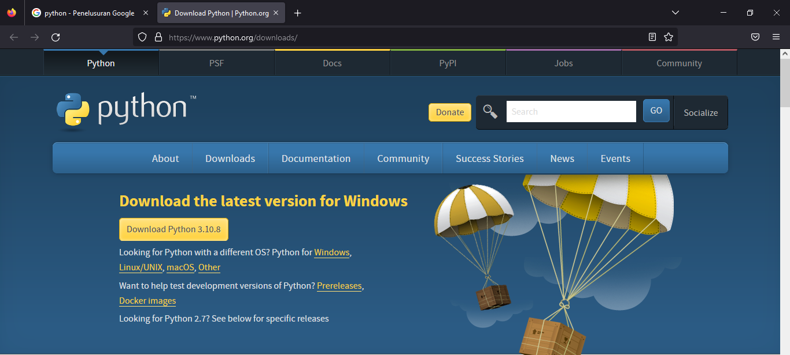
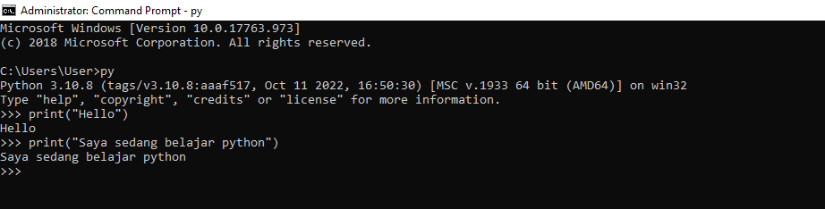
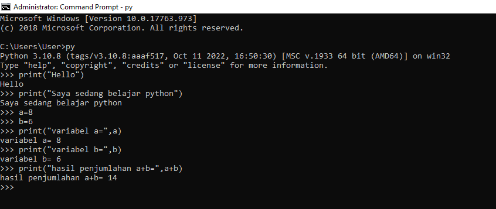
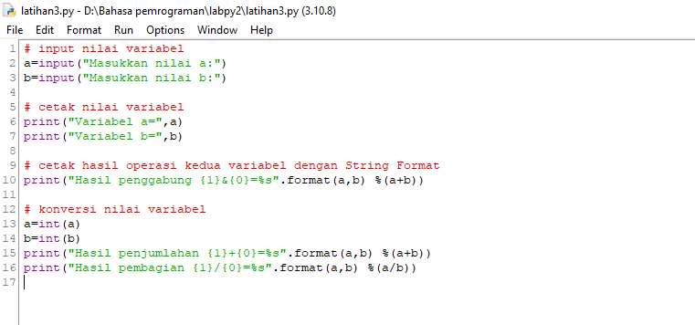
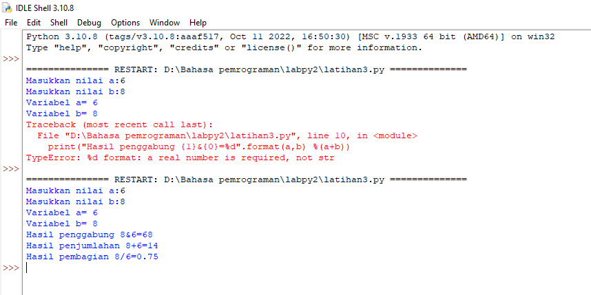
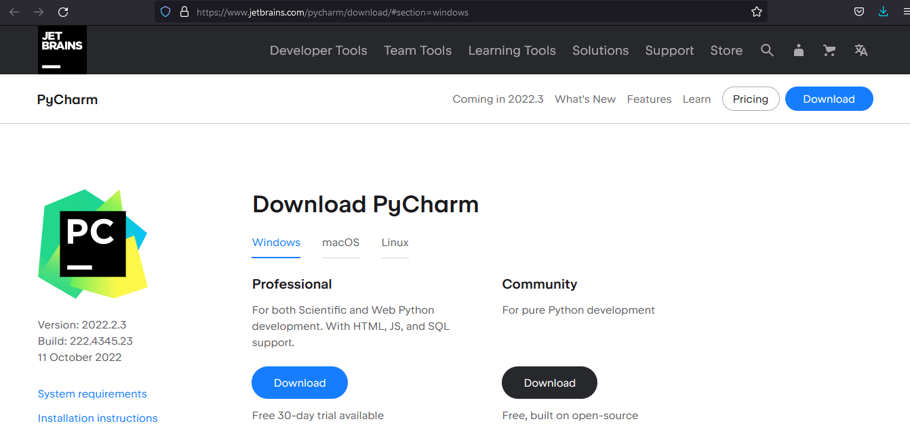
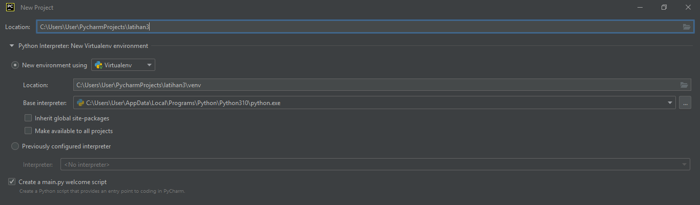
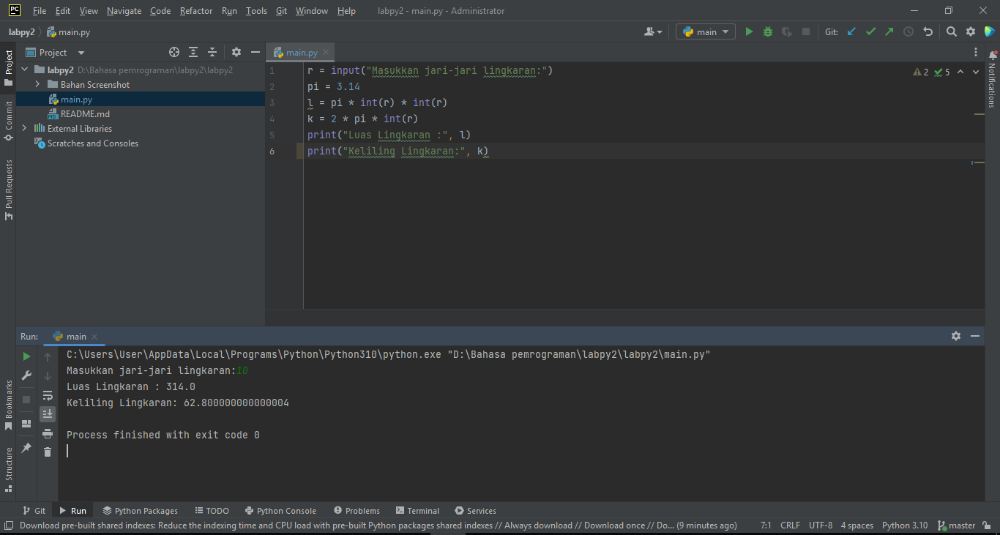

# Latihan step by step menggunakan Python

- Pertama Download https://www.python.org/downloads/

- Memanggil Input
> print("Hello)

> print("Saya sedang belajar Python")

- Menjumlahkan dua buah bilangan menggunakan variabel a dan b
> a = 8

> b = 6

> print ("variabel a=",a)

> print ("variabel b=",b)

> print ("hasil penjumlahan a+b",a+b)

- Menjalankan IDLE

- Menggunakan fungsi Input untuk mengambil nilai variabel dari keyboard
 >input nilai variable

> a=input("Masukkan nilai a:")

> b=input("Masukkan nilai b:")

> cetak nilai variable

> print("Variabel a=",a)

> print("Variabel b=",b)

> cetak hasil operasi kedua dengan String Format
    
> print("Hasil penggabungan {1}&{0}=%s".format(a,b) %(a+b))

>konversi nilai variable

>a=int(a)

>b=int(b)

>print("Hasil penjumlahan {1}+{0}=%s".format(a,b) %(a+b))

>print("Hasil pembagian {1}/{0}=%s").format(a,b) %(a/b))

- Lalu coba di run

- Selanjutnya Download Pycharm https://www.jetbrains.com/pycharm/download/#section=windows

- Lalu ini untuk mengatur lokasi di mana file akan disimpan

- Menambahkan File baru
> Klik kanan pada bagian folder Directory, Klik "New", Klik "Python File"

- Menghitung Luas dan Keliling Lingkaran dengan PyCharm

>r = input("Masukkan jari-jari lingkaran : ")

>pi = 3.14

>l = pi * int(r) * int(r)

>k = 2 * pi * int(r)

>print("Luas Lingkaran : ",l)

>print("Keliling Lingkaran : ",k)

